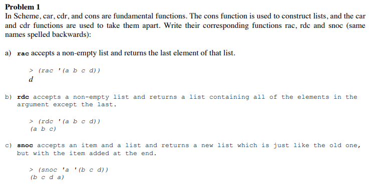
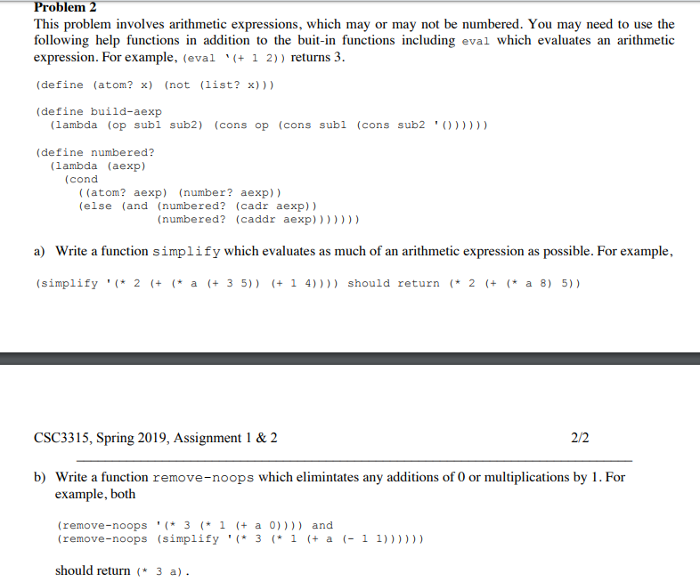
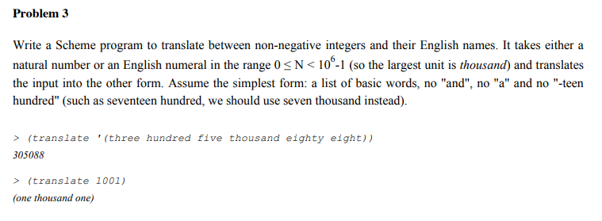

# Scheme-Programming
## Problem 1  
 
* Answer:  

a)  rac in Scheme  
(define rac (l)  
  (car (reverse l)))    
  
b)  rdc in Scheme  
(define rdc (l)  
(reverse (cdr (reverse l))))    

c)  snoc in Scheme  
(define snoc (a l)  
 (reverse (cons a (reverse l))))    

## Problem 2  
 
* Answer:  

a) function simplify in Scheme  
(define simplify(l)  
  (list(list '+   (lambda (u v)(list '+ (d u) (d v))))  
       (list '-   (lambda (u v)(list '- (d u) (d v))))  
       (list '*   (lambda (u v)(list '+ (list '* u (d v))(list '* (d u) v))))))   
       
b) function remove-noops in Scheme  
(define (remove-noops pred l)  
 (cond ((null? l) l)  
 ((pred (car l)) (remove-noops pred (cdr l)))  
 (else (cons (car l) (remove-noops pred (cdr l)))))    

## Problem 3  
 
* Answer:  

#translate numbers to words  
(define translate1 (W)  
  (cond ((= n 0) ('EMPTY))  
      (else ((> n 19) ( + ( + Y[n // 10] X[n % 10]) W)))  
      (else ((>= 19 n) (+ X[n] W)))))  

# Helpful slides to undertand more about this scheme programming:
<object data="https://alandix.com/academic/teaching/AI355/pdfs/scheme%20(CSc355%20version)-6up.pdf" type="application/pdf" width="700px" height="700px">
    <embed src="https://alandix.com/academic/teaching/AI355/pdfs/scheme%20(CSc355%20version)-6up.pdf">
        
This browser does not support PDFs. Please download the PDF to view it: <a href="https://alandix.com/academic/teaching/AI355/pdfs/scheme%20(CSc355%20version)-6up.pdf">Download PDF</a>.

    </embed>
</object>
